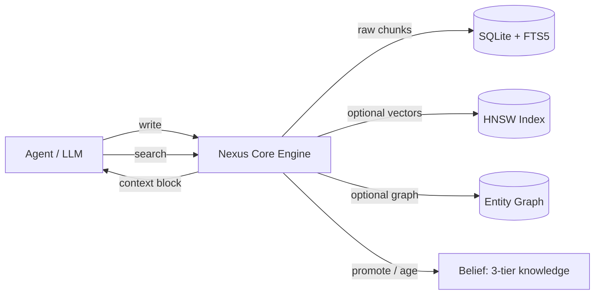

[](https://github.com/chuf-China/nexus-memory/actions/workflows/nexus-ci.yml)
[](LICENSE)
[](https://www.python.org/downloads/)
[](https://github.com/chuf-China/nexus-memory/stargazers)
[](https://github.com/chuf-China/nexus-memory/commits/main)
[](https://github.com/chuf-China/nexus-memory/pulls)

[English](README.md) · [简体中文](README_CN.md)

<div align="center">

<h3 align="center">🧠 Nexus Memory</h3>

**The zero-LLM, local-first memory layer for AI agents.**

Persistent cross-session memory — no LLM calls to write, no cloud to leak, no service to run.

<br>

[Quick Start](#quick-start) · [Benchmarks](#benchmarks) · [Architecture](#architecture) · [Install](#install) · [API](#api) · [Report Issue](https://github.com/chuf-China/nexus-memory/issues)

</div>

---

## Why Nexus?

Every AI agent starts from zero each session. You re-explain your stack, your preferences, your corrections — and pay for the context window every time. Nexus gives agents a persistent brain without the usual memory-layer bill:

- **Zero LLM dependency** — writing and retrieving memories costs nothing in tokens, is fully reproducible, and runs offline. Ingest is raw chunk storage; no distillation, no prompt fees, no model drift.
- **Local-first by design** — a single SQLite file. Your data never leaves your machine. No external service, no API key, no privacy review needed.
- **Drop-in compatible** — implements the same client interface as popular memory layers (a `NexusMemoryClient` adapter exists), so switching backends in an existing agent or benchmark harness is a one-line change.

## Nexus vs. LLM-based memory

| | **Nexus Memory** | LLM-based memory (e.g. mem0) |
|---|---|---|
| Ingest cost | **$0** — zero LLM calls | Every write pays LLM tokens |
| Data locality | Fully local, works offline | Depends on cloud LLM APIs |
| Deployment | One SQLite file | Service + model endpoints |
| LoCoMo accuracy | **76.2%** (zero-LLM ingest) | 92.5% (third-party, LLM-distilled ingest) |
| Retrieval latency | **131ms** p50 (pure retrieval, 200 results/query) | 0.88–1.09s per question incl. LLM (third-party) |

The trade-off is explicit: you give up the last few accuracy points and gain zero cost, full privacy, and complete reproducibility.

## Quick Start

```python
from src.nexus_core import NexusCore

nexus = NexusCore("agent_memory.db")                    # one file = whole memory

nexus.write("User prefers Python type hints", source_session_id="conversation")
ctx = nexus.search("What coding style does the user prefer?", limit=5)
prompt = f"Memories:\n{ctx}\nUser: ..."                 # inject into any agent
```

That's the entire memory layer. Write, retrieve, inject — no LLM in between.

## Benchmarks

Full LoCoMo evaluation via the [memory-benchmarks](https://github.com/mem0ai/memory-benchmarks) framework — 10 long-term conversations, **1,540 questions**, 4 categories. Ingest ran as pure raw-chunk writes (**zero LLM calls**); answerer/judge: `deepseek-v4-flash`.

| Category | Questions | Accuracy |
|----------|-----------|----------|
| **Overall** | **1,540** | **76.2%** (1,173/1,540) |
| Single-hop | 841 | 88.1% |
| Multi-hop | 282 | 84.0% |
| Open-domain | 96 | 66.7% |
| Temporal | 321 | 40.8% |

- **Zero empty answers** across the full run
- Retrieval (hybrid mode, 200 results/query): **p50 131ms**, p90 142ms
- Reference: mem0 platform reports 92.5% on the same benchmark (third-party result; LLM-distilled ingest)

**Known gap — temporal reasoning (40.8%)**: ingest stores raw chunks verbatim, so relative time words ("last week") are never normalized to absolute dates. Ingest-side time normalization is the next planned fix.

### Benchmark switches

High-concurrency eval runs can skip optional heavy stages via environment variables:

| Variable | Effect |
|----------|--------|
| `NEXUS_NO_RERANK=1` | Skip cross-encoder reranking (10-20x per-search slowdown under 10+ concurrent searches) |
| `NEXUS_NO_GRAPH=1` | Skip entity-graph traversal (recursive CTE on hub nodes can take 10s+ at 10k+ relations) |
| `NEXUS_EVAL_DB=/path` | Override the eval database path |

## Architecture



- **3-layer knowledge** — Observation (0.30–0.50) → Belief (0.50–0.85) → Fact (0.85+), auto-promoted by repetition or confirmation, auto-aged and archived
- **6-domain scoring** — freshness · importance · frequency · relevance · confidence · feedback
- **Hybrid retrieval** — FTS5 full-text + optional vector + optional entity-graph, fused and reranked
- **CJK-aware search** — OR-semantics with unigram pruning; multi-character Chinese queries recall correctly instead of silently returning zero results
- **Built-in security** — 13 threat patterns (prompt injection / SQL injection / XSS) scanned before memory reaches a prompt

## Install

```bash
git clone https://github.com/chuf-China/nexus-memory.git
cd nexus-memory
pip install -e .
```

Optional extras (defined in `pyproject.toml`): `[vector]` for fastembed/hnswlib, `[llm]` for LLM integration, `[full]` for everything.

## CLI

```bash
nexus-memory status           # Show DB stats
nexus-memory search "query"   # Search knowledge
nexus-memory export           # Export to JSON
nexus-memory benchmark        # Run performance test
```

## API

```python
from src.nexus_core import NexusCore

nexus = NexusCore("nexus.db")

# Write
nexus.write(content, source_session_id="conversation", initial_confidence=0.9)

# Search (modes: fts / semantic / graph / hybrid)
results = nexus.search(query, limit=5, mode="hybrid")
results = nexus.search_by_domain(domain="workflow", limit=5)

# System prompt injection (with built-in threat scanning)
block = nexus.system_prompt_block()

# Lifecycle
nexus.consolidate(user_id="default")
nexus.knowledge_snapshot()
nexus.search_temporal(query)
nexus.get_history(knowledge_id)
alerts = nexus.get_alerts()
```

## Directory Structure

```
nexus-memory/
├── src/
│   ├── nexus_core.py            # Core engine (composes the mixins below)
│   ├── nexus_core_write.py      # Write / belief / conflict-detection mixin
│   ├── nexus_core_stats.py      # Stats / consolidate / system-prompt mixin
│   ├── nexus_core_search_ext.py # Hybrid search mixin
│   ├── nexus_core_db.py         # DB init & schema mixin
│   ├── nexus_core_audit.py      # Audit / temporal mixin
│   ├── nexus_core_session.py    # Cross-session identity mixin
│   ├── nexus_core_snapshot.py   # Snapshot mixin
│   ├── security.py              # Threat scanning, API keys, rate limiting
│   ├── nexus_drive.py           # Data persistence layer
│   ├── nexus_extract.py         # Knowledge extractor
│   ├── nexus_search.py          # Enhanced recall (expansion, negation)
│   ├── nexus_embedder.py        # Vector embedding (optional)
│   ├── nexus_hnsw.py            # HNSW index (optional)
│   ├── nexus_graph.py           # Graph relationships
│   ├── nexus_belief.py          # Belief network (3-tier promotion)
│   ├── nexus_constitution.py    # Security defense
│   ├── nexus_evolve.py          # Self-evolution (aging + consolidation)
│   ├── nexus_miner.py           # Knowledge mining
│   ├── nexus_cli.py             # CLI tool
│   ├── nexus_local.py           # Local storage
│   └── nexus_utils.py           # Utilities
├── tests/                       # Module / extended / security / benchmark tests
├── docs/
│   └── architecture.md          # Architecture documentation
├── pyproject.toml               # PyPI packaging
└── README.md                    # This file
```

## Dependencies

**Core (required):** Python 3.9+ · SQLite 3.38+ (FTS5) · numpy

**Optional:** fastembed + hnswlib (vector search) · openai (LLM integration) · sentence-transformers (advanced embeddings)

**No external service dependencies** — pure local execution.

## Run Tests

```bash
pip install -e ".[dev]"
python -m pytest tests/ -v
python -m pytest tests/ -v --cov=src --cov-report=html   # with coverage
```

## License

MIT License

## Acknowledgments

Built as the memory backbone of Hermes Agent. Inspired by Karpathy's LLM Wiki pattern — extended with confidence scoring, lifecycle management, knowledge graphs, and hybrid search.

---

**If Nexus Memory helps your agent, give it a ⭐**
