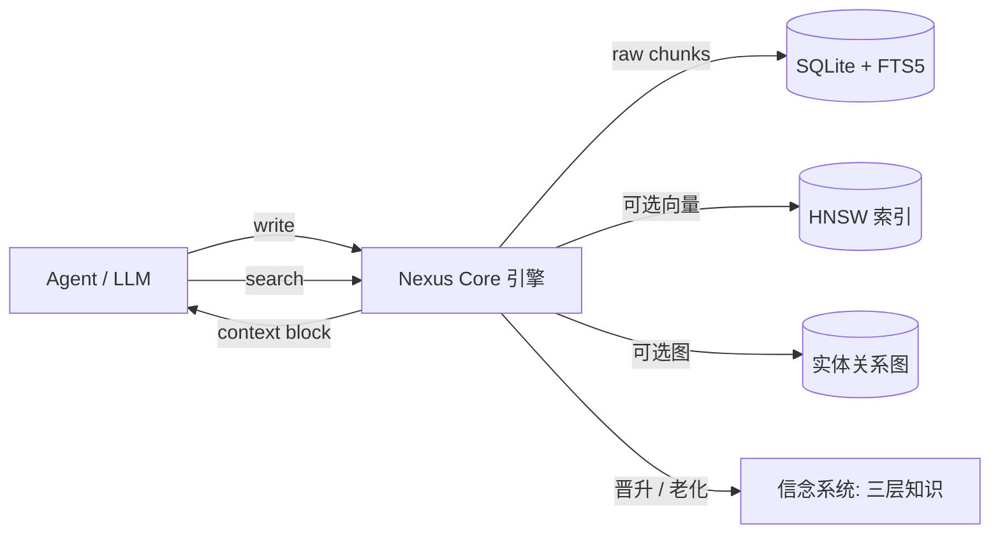

[](https://github.com/chuf-China/nexus-memory/actions/workflows/nexus-ci.yml)
[](https://opensource.org/licenses/MIT)
[](https://www.python.org/downloads/)
[](https://github.com/chuf-China/nexus-memory/tree/main/tests)
[](https://github.com/chuf-China/nexus-memory/stargazers)

[简体中文](README_CN.md) · [English](README.md)

<div align="center">

<h3 align="center">🧠 Nexus 记忆系统</h3>

**零 LLM 依赖的本地优先 AI Agent 记忆层。**

跨会话持久记忆——写入零成本、数据不出本地、无需部署服务。

<br>

[快速开始](#快速开始) · [评测基准](#locomo-评测基准) · [架构](#架构) · [安装](#安装) · [API](#api) · [报告问题](https://github.com/chuf-China/nexus-memory/issues)

</div>

---

## 为什么选 Nexus？

每个 AI Agent 每次会话都从零开始。你要反复解释技术栈、偏好、修正——并且为每一次上下文窗口付费。Nexus 给 Agent 一个持久大脑，却不附带记忆层的常规账单：

- **零 LLM 依赖** — 写入和检索不消耗任何 token，完全可复现，离线可用。ingest 是纯 raw chunk 存储：无蒸馏、无 prompt 费用、无模型漂移
- **本地优先** — 一个 SQLite 文件即全部记忆。数据永不离开你的机器，无外部服务、无 API key、无需隐私审查
- **即插即用** — 实现与主流记忆层相同的 client 接口（已提供 `NexusMemoryClient` 适配器），现有 Agent 或评测框架切换后端只需改一行

## Nexus vs LLM 记忆层

| | **Nexus 记忆系统** | LLM 蒸馏式记忆（如 mem0） |
|---|---|---|
| 写入成本 | **¥0** — 零 LLM 调用 | 每次写入消耗 LLM token |
| 数据归属 | 完全本地，可离线 | 依赖云端 LLM API |
| 部署形态 | 单个 SQLite 文件 | 服务 + 模型端点 |
| LoCoMo 准确率 | **76.2%**（零 LLM ingest） | 92.5%（第三方，LLM 蒸馏 ingest） |
| 检索延迟 | **131ms** p50（纯检索，200 results/query） | 0.88–1.09s/题（含 LLM，第三方） |

取舍是明确的：让出最后几个准确率点，换来零成本、完全隐私、完全可复现。

## 快速开始

```python
from src.nexus_core import NexusCore

nexus = NexusCore("agent_memory.db")                    # 一个文件 = 全部记忆

nexus.write("用户偏好简洁回答", source_session_id="conversation")
ctx = nexus.search("用户喜欢什么样的回答风格？", limit=5)
prompt = f"相关记忆：\n{ctx}\n用户：..."                 # 注入任意 Agent
```

这就是完整的记忆层。写入、检索、注入——中间没有 LLM。

## LoCoMo 评测基准

基于 [memory-benchmarks](https://github.com/mem0ai/memory-benchmarks) 框架的全量端到端评测：10 段长对话、**1,540 道题**、4 个类别。ingest 为纯 raw chunk 写入（**零 LLM 调用**）；answerer/judge 使用 `deepseek-v4-flash`。

| 类别 | 题数 | 准确率 |
|------|------|--------|
| **总体** | **1,540** | **76.2%**（1,173/1,540） |
| Single-hop | 841 | 88.1% |
| Multi-hop | 282 | 84.0% |
| Open-domain | 96 | 66.7% |
| Temporal | 321 | 40.8% |

- **全量运行零空答案**
- 检索（hybrid 模式，200 results/query）：p50 **131ms**，p90 142ms
- 参照：mem0 平台同基准 92.5%（第三方结果，LLM 蒸馏式 ingest）

**已知短板 — 时间推理（40.8%）**：ingest 原样存储 raw chunk，"last week" 等相对时间词未归一化为绝对日期。计划修复方向：ingest 侧时间归一化。

### 评测开关

高并发评测可用环境变量跳过可选重阶段：

| 变量 | 作用 |
|------|------|
| `NEXUS_NO_RERANK=1` | 跳过 cross-encoder 重排（10+ 并发下单次 search 慢 10-20 倍） |
| `NEXUS_NO_GRAPH=1` | 跳过图遍历（万级关系表上 hub 节点递归 CTE 10s+） |
| `NEXUS_EVAL_DB=/path` | 覆盖评测数据库路径 |

## 架构



- **三层认知架构** — Observation (0.30–0.50) → Belief (0.50–0.85) → Fact (0.85+)，重复或确认自动晋升，超期自动老化归档
- **六域评分** — 新鲜度 · 重要性 · 访问频率 · 关联度 · 置信度 · 反馈分
- **混合检索** — FTS5 全文 + 可选向量 + 可选实体图，多路召回融合重排
- **中文检索友好** — OR 语义 + unigram 剪枝；多字中文查询正确召回，不会静默返回零结果
- **内置安全防御** — 13 类威胁模式（提示注入 / SQL 注入 / XSS），进入 prompt 前逐条扫描

## 安全防御

Nexus 内置 13 类威胁模式检测（`src/security.py`）：

- **提示注入 / 记忆投毒**（context 作用域）：忽略指令、角色替换、系统提示泄露、base64 编码指令等中英文模式
- **SQL 注入 / XSS**（通用作用域）：SQL 关键词、注释符、引号转义、script 标签、事件属性

两级作用域控制：
- `context`：记忆注入 system prompt 前逐条扫描，命中即替换为 `[BLOCKED: ...]`
- 通用：输入侧 SQL 注入 / XSS 技术性检测

## 性能基准

| 操作 | 延迟（平均） | 说明 |
|------|------|------|
| FTS5 精确检索 | 0.10ms | SQLite 全文索引，2000 条语料实测（修复前 11ms，110x；结果 ≤ limit 时跳过模型重排） |
| hybrid 融合检索 | 0.58ms | FTS + 向量 + 图多路召回合并重排（2000 条语料实测） |
| 向量语义检索 | 23.4ms | 需 fastembed 模型，无模型时回退 FTS |
| 图关系查询 | 8.6ms | 实体关系遍历 |
| 时间感知检索 | 19.7ms | 时间词解析 + 多跳 |

> 注：上表为单次调用微基准（2000 条语料）；[LoCoMo 评测](#locomo-评测基准) 中的 131ms 为端到端检索（含 embedding 回退尝试、200 results/query、多路融合），口径不同。

## 安装

```bash
git clone https://github.com/chuf-China/nexus-memory.git
cd nexus-memory
pip install -e .
```

可选 extras（见 `pyproject.toml`）：`[vector]`（fastembed/hnswlib）、`[llm]`（LLM 集成）、`[full]`（全部）。

## CLI

```bash
nexus-memory status           # 查看数据库统计
nexus-memory search "查询"    # 检索知识
nexus-memory export           # 导出 JSON
nexus-memory benchmark        # 运行性能测试
```

## API

```python
from src.nexus_core import NexusCore

nexus = NexusCore("nexus.db")

# 写入
nexus.write(content, source_session_id="conversation", initial_confidence=0.9)

# 检索（模式：fts / semantic / graph / hybrid）
results = nexus.search(query, limit=5, mode="hybrid")
results = nexus.search_by_domain(domain="workflow", limit=5)

# 注入 system prompt（含内置威胁扫描）
block = nexus.system_prompt_block()

# 生命周期
nexus.consolidate(user_id="default")
nexus.knowledge_snapshot()
nexus.search_temporal(query)
nexus.get_history(knowledge_id)
alerts = nexus.get_alerts()
```

## 目录结构

```
nexus-memory/
├── src/
│   ├── nexus_core.py            # 核心引擎（组合以下 mixin）
│   ├── nexus_core_write.py      # 写入 / 信念 / 冲突检测 mixin
│   ├── nexus_core_stats.py      # 统计 / 合并 / system prompt mixin
│   ├── nexus_core_search_ext.py # 混合检索 mixin
│   ├── nexus_core_db.py         # 数据库初始化与 schema mixin
│   ├── nexus_core_audit.py      # 审计 / 时间感知 mixin
│   ├── nexus_core_session.py    # 跨会话身份 mixin
│   ├── nexus_core_snapshot.py   # 快照 mixin
│   ├── security.py              # 威胁扫描、API key、限流
│   ├── nexus_drive.py           # 数据持久化层
│   ├── nexus_extract.py         # 知识提取器
│   ├── nexus_search.py          # 增强召回（扩展、否定）
│   ├── nexus_embedder.py        # 向量嵌入（可选）
│   ├── nexus_hnsw.py            # HNSW 索引（可选）
│   ├── nexus_graph.py           # 图关系存储
│   ├── nexus_belief.py          # 信念网络（三层晋升）
│   ├── nexus_constitution.py    # 安全防御系统
│   ├── nexus_evolve.py          # 自进化机制（老化 + 合并）
│   ├── nexus_miner.py           # 知识挖掘
│   ├── nexus_cli.py             # 命令行工具
│   ├── nexus_local.py           # 本地存储
│   └── nexus_utils.py           # 工具函数
├── tests/                       # 模块集成 / 扩展 / 安全 / 性能测试
├── docs/
│   └── architecture.md          # 架构文档
├── pyproject.toml               # 安装配置
└── README_CN.md                 # 本文件
```

## 依赖

**核心（必需）**：Python 3.9+ · SQLite 3.38+（FTS5）· numpy

**可选**：fastembed + hnswlib（向量检索）· openai（LLM 集成）· sentence-transformers（高级嵌入）

**无外部服务依赖** — 纯本地运行。

## 运行测试

```bash
pip install -e ".[dev]"
python -m pytest tests/ -v
python -m pytest tests/ -v --cov=src --cov-report=html   # 覆盖率
```

## 许可证

MIT License

## 作者

chuf-China

## 致谢

基于 [Hermes Agent](https://github.com/NousResearch/hermes-agent) 的记忆系统架构设计。启发自 Karpathy 的 LLM Wiki 模式——扩展了置信度评分、生命周期管理、知识图谱与混合检索。

---

**如果 Nexus 记忆系统对你的 Agent 有帮助，给它一个 ⭐**
